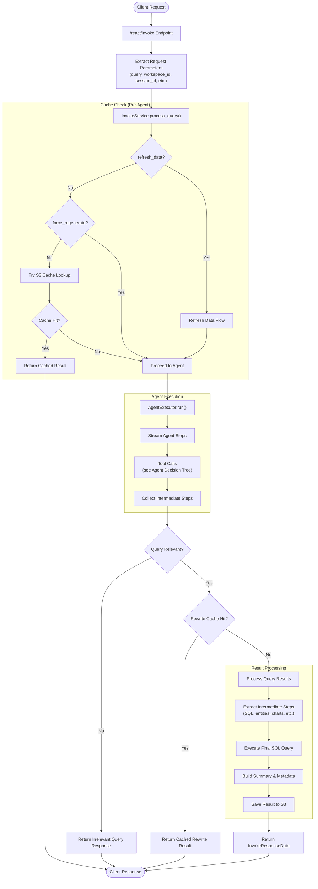
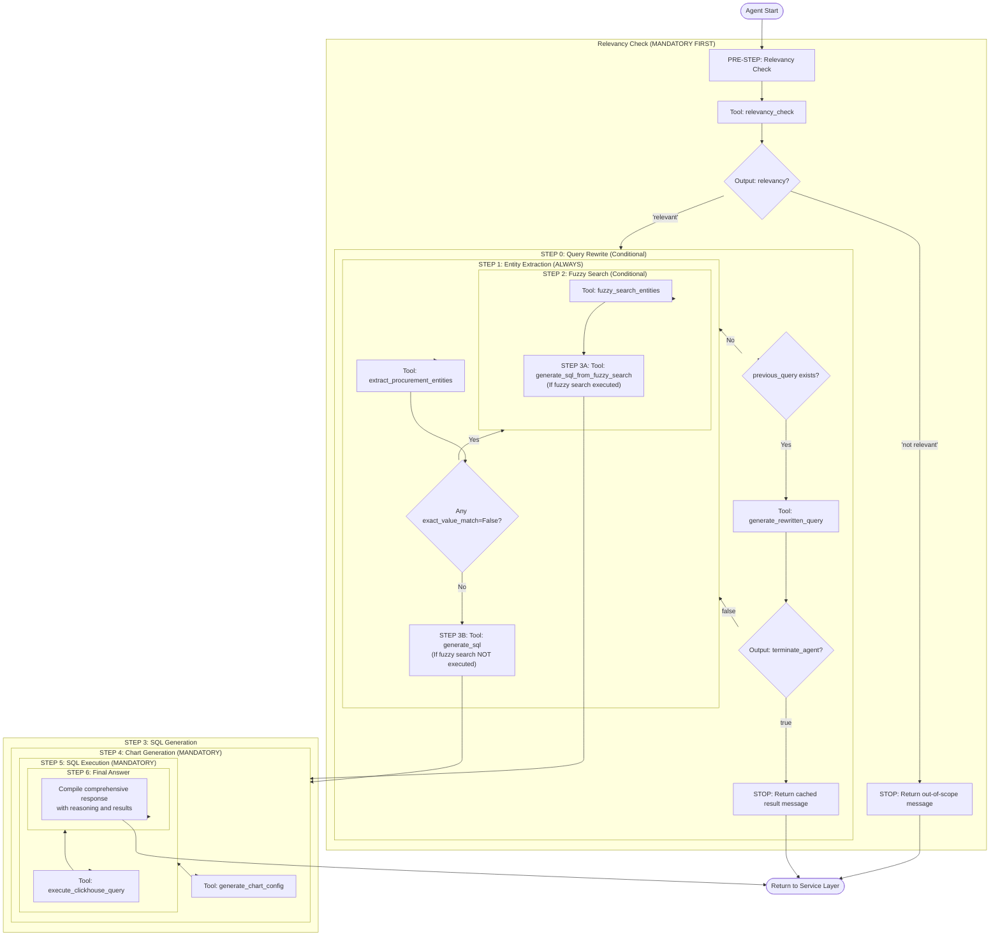
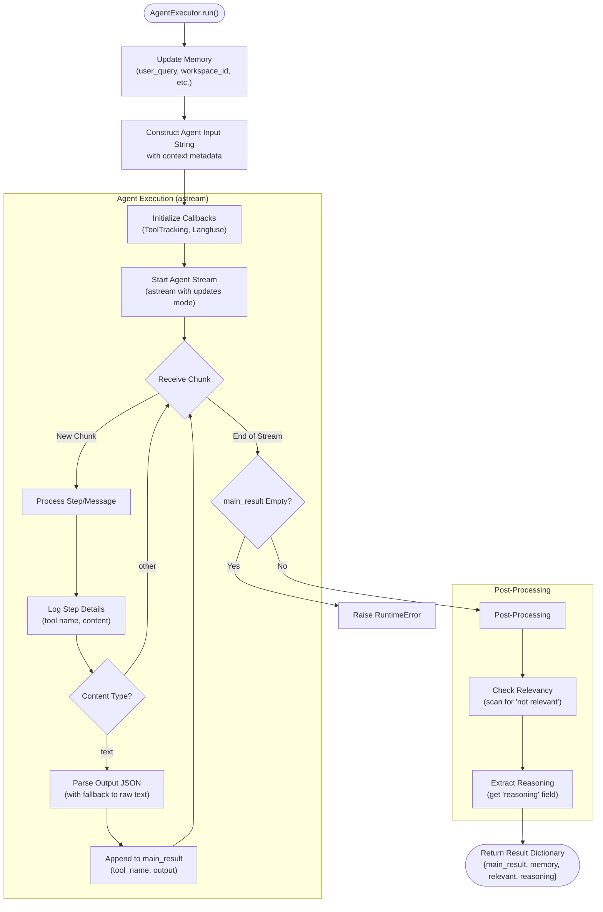

# ReAct Agent Flow Documentation

This document explains the functionality and working of the **ReAct agent** system, a LangChain-based tool-calling agent for **procurement data analysis** using natural language queries. The system is implemented as a FastAPI application with intelligent caching, SQL generation, and multi-turn query support.

---

## Table of Contents

1. [System Overview](#system-overview)
2. [Architecture Components](#architecture-components)
3. [Complete Request Flow](#complete-request-flow)
4. [Agent Decision Tree](#agent-decision-tree)
5. [FastAPI Routes](#fastapi-routes)
6. [AgentExecutor Implementation](#agentexecutor-implementation)
7. [Available Tools](#available-tools)

---

## System Overview

The system processes natural language queries about procurement data and converts them into SQL queries for ClickHouse, executes them, generates charts, and provides insights. It follows a **ReAct (Reasoning + Acting)** pattern where the agent thinks before every action.

**Key Features:**

- Multi-turn conversation support with query rewriting
- Intelligent caching (S3-based)
- Relevancy checking for out-of-scope queries
- Entity extraction and fuzzy search for database value matching
- Automatic chart configuration generation
- Procurement-specific SQL generation for ClickHouse

---

## Architecture Components

### 1. **FastAPI Route Layer** (`routes/react.py`)

- Handles HTTP requests
- Validates input
- Delegates to service layer
- Returns structured responses

### 2. **Service Layer** (`services/invoke_service.py`)

- Orchestrates the entire query processing flow
- Manages caching logic
- Processes agent results
- Extracts and structures intermediate steps

### 3. **Agent Controller** (`controller/react.py`)

- Executes the LangChain ReAct agent
- Streams agent execution steps
- Manages tool calls and callbacks
- Returns structured results with reasoning

### 4. **Tools** (`agents_tools/`)

- Individual tools for specific tasks (SQL generation, entity extraction, etc.)
- Each tool follows a consistent interface
- Tools return structured outputs

---

## Complete Request Flow

The following diagram shows the end-to-end request flow from FastAPI route to final response:



---

## Agent Decision Tree

The ReAct agent follows a **strict decision tree** based on its system prompt. Here's the detailed flow:



### Agent Critical Rules

1. **Thought Before Action**: Every tool call must be prefaced with "Thought:" explaining the reasoning
2. **Mandatory Relevancy Check**: First tool call must always be `relevancy_check`
3. **Conditional Rewrite**: Only execute `generate_rewritten_query` if `previous_query` exists
4. **Fuzzy Search Decision**: Only use fuzzy search if entities have `exact_value_match=False`
5. **SQL Generation Path**:
   - **Path A**: If fuzzy search executed → use `generate_sql_from_fuzzy_search`
   - **Path B**: If fuzzy search NOT executed → use `generate_sql`
6. **Mandatory Execution**: Never skip `execute_clickhouse_query` for data queries
7. **Chart Generation**: Always execute `generate_chart_config` after SQL generation
8. **Workspace ID**: All tools require `workspace_id` parameter extracted from context

---

## FastAPI Routes

### POST `/react/invoke`

**Purpose**: Main endpoint for processing natural language procurement queries.

**Request Model**: `RequestModel`

```python
{
  "input": {
    "query": str,
    "previous_query": Optional[str],
    "workspace_id": int,
    "user_config": {
      "session_id": str,
      "user_id": str,
      "force_regenerate": bool,
      "refresh_data": bool
    },
    "additional_info": {
      "source_screen": str,
      "run_id": Optional[str]
    }
  }
}
```

**Response Model**: `SuccessResponse[InvokeResponseData]`

```python
{
  "success": bool,
  "data": {
    "result": QueryResult,
    "timing": dict,
    "error": Optional[dict]
  }
}
```

**Flow**:

1. Extract and validate query parameters
2. Delegate to `InvokeService.process_query()`
3. Handle exceptions and return fallback result on error
4. Return structured response with timing information

---

### POST `/react/fetchdata`

**Purpose**: Fetch previously cached query results from S3.

**Request**: `{ "s3_key": str }`

**Response**: Cached query data from S3

---

### GET `/react/get-insights/{file_name}`

**Purpose**: Retrieve or generate insights for a cached query result.

**Flow**:

1. Check if file exists in S3
2. Look for existing insights
3. If no insights, generate using LLM
4. Return insights with S3 file key

---

## AgentExecutor Implementation

The `AgentExecutor` class in `controller/react.py` manages the agent execution lifecycle:



### Key Methods

**`_tool_output_parser(text: str)`**

- Attempts to parse tool output as JSON
- Falls back to `{"reasoning": text}` if parsing fails

**`_get_reasoning(steps: List)`**

- Extracts the last valid "reasoning" field from steps
- Returns empty string if no reasoning found

**`_check_relevancy(steps: List)`**

- Scans for "not relevant", "irrelevant", or "no" in relevancy field
- Returns `False` if query is irrelevant, `True` otherwise

---

## Available Tools

The agent has access to the following tools (in order of typical usage):

| Tool Name | Purpose | Key Inputs | Key Outputs |
|-----------|---------|------------|-------------|
| `relevancy_check` | Validate query is procurement-related | `user_query`, `workspace_id` | `relevancy`, `user_query` |
| `rewritten_query` | Rewrite follow-up queries with context | `user_query`, `previous_query`, `workspace_id` | `rewritten_query`, `s3_filekey`, `terminate_agent` |
| `entity_extraction` | Extract entities (suppliers, dates, etc.) | `user_query`, `workspace_id` | `entities` (list with `exact_value_match`) |
| `fuzzy_search` | Find database values for entities | `entities`, `workspace_id` | `results` (validated entity values) |
| `generate_sql` | Generate SQL from extracted entities | `user_query`, `entities`, `workspace_id` | `generated_sql` |
| `fuzzy_search_sql_generator` | Generate SQL using fuzzy search results | `user_query`, `fuzzy_results`, `workspace_id` | `generated_sql` |
| `execute_sql` | Execute SQL query on ClickHouse | `sql_query`, `workspace_id` | `results`, `columns`, `row_count` |
| `chart_and_blurb` | Generate chart config and description | `sql_query`, `results`, `user_query` | `chart_config`, `blurb` |

---

## Database Context

The agent works with ClickHouse tables following the pattern:

- **Table Name**: `workspace_<workspace_id>_view`
- **Key Metrics**:
  - `ai_amount_usd`: Spend amounts
  - `ai_supplier_name`: Supplier names
- **Categories**: `ai_category_l1` through `ai_category_l4`
- **Geography**: `invoice_region` (NA, EMEA, SA)
- **Time**: `invoice_accountingdate`
- **Materials**: `ai_invoice_material_desc`

---

## Example Query Flow

**User Query**: "Show me top 5 suppliers by spend in North America"

1. **Relevancy Check** → "relevant"
2. **Entity Extraction** → `{"region": "North America", "limit": 5}`
3. **Fuzzy Search** → Validate "North America" maps to "NA"
4. **SQL Generation** → Generate ClickHouse SQL with proper filters
5. **Chart Generation** → Bar chart config for top suppliers
6. **SQL Execution** → Execute and retrieve results
7. **Final Answer** → Return structured response with chart, data, and reasoning
